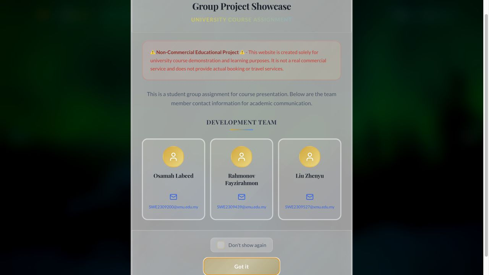
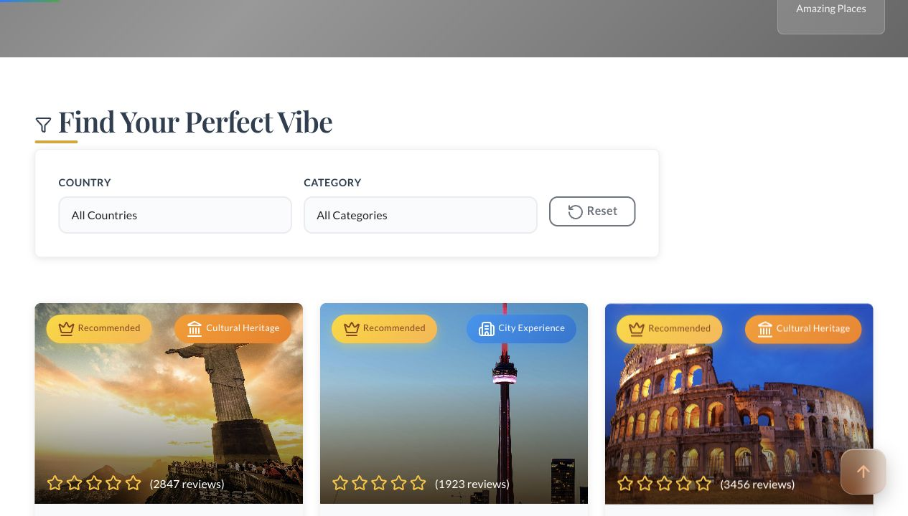
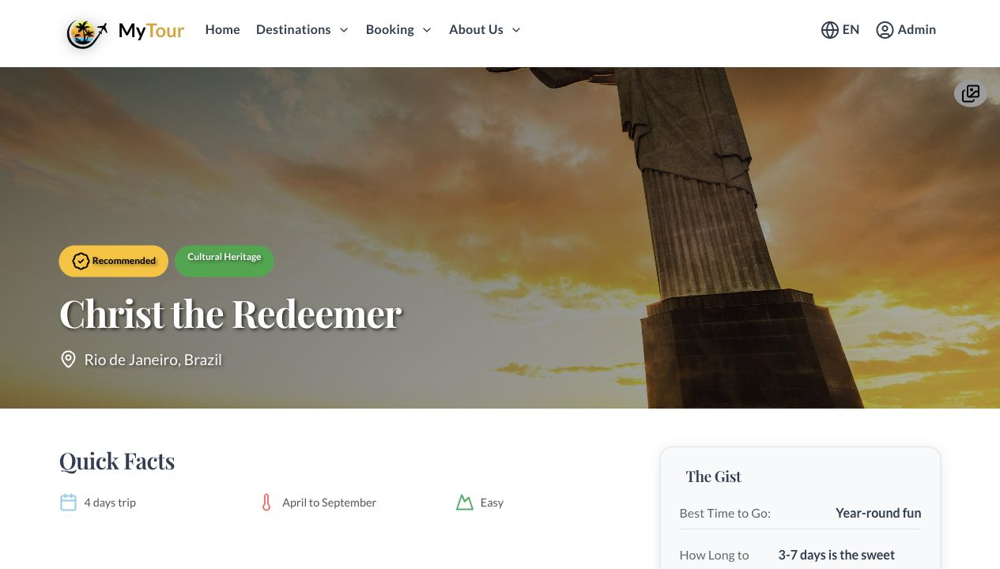
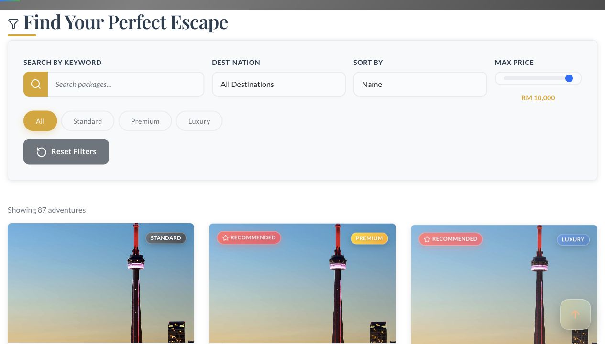
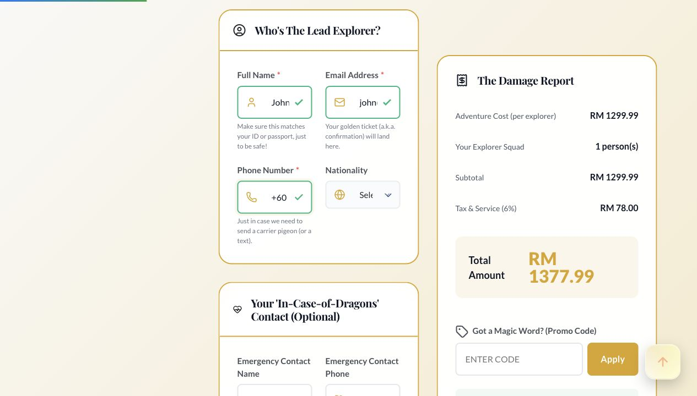
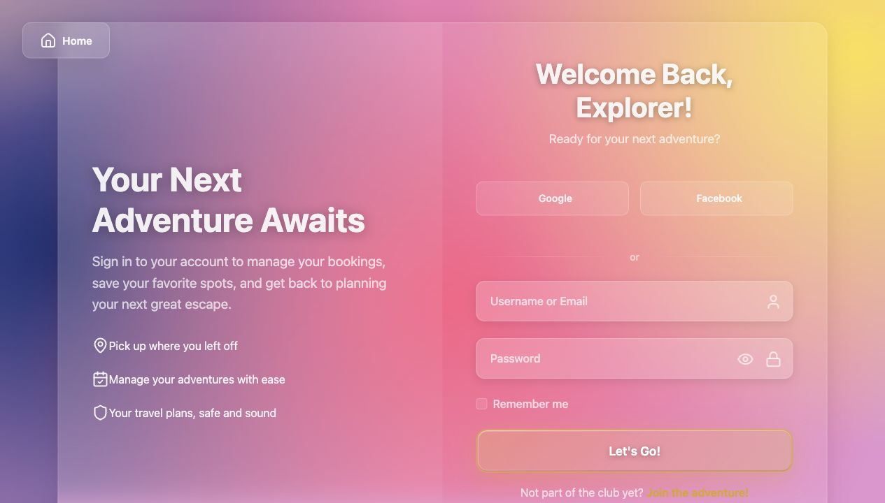

# SWE306 Programming Elective II (1) TravelBlog

Spring Boot travel blog application with JSP pages, MySQL persistence, and admin/user content flows.

## Screenshots



| Destinations | Destination Detail |
| --- | --- |
|  |  |

| Packages | Booking |
| --- | --- |
|  |  |

| Login |
| --- |
|  |

## Tech Stack

- Java 21, Spring Boot 3.5
- Spring MVC, Spring Data JPA, Hibernate
- JSP/JSTL, Bootstrap
- MySQL
- Maven

## Run Locally

Create the database:

```bash
mysql -u root -p < database-init.sql
```

Configure local environment values:

```bash
export DB_URL="jdbc:mysql://localhost:3306/mytour_travel?useSSL=false&serverTimezone=UTC&allowPublicKeyRetrieval=true"
export DB_USERNAME="root"
export DB_PASSWORD="your_password"
export JWT_SECRET="change_me"
```

Start the app:

```bash
mvn spring-boot:run
```

Open `http://localhost:8080`.

## Build

```bash
mvn clean package
```
